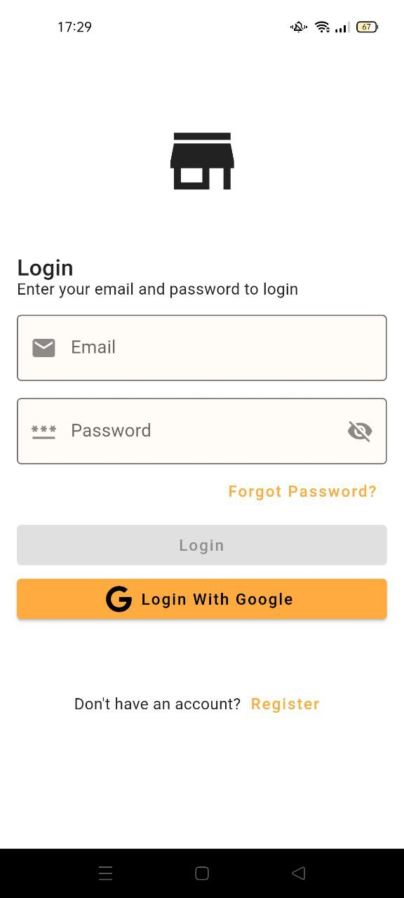
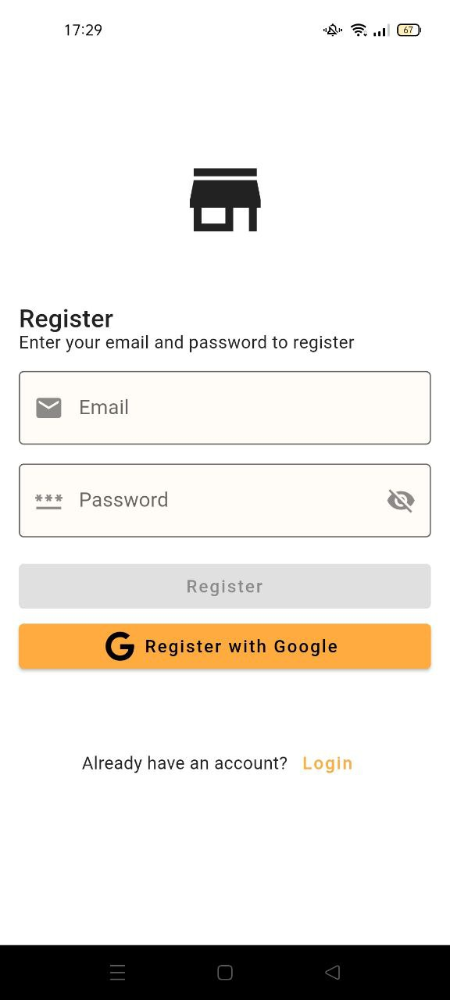
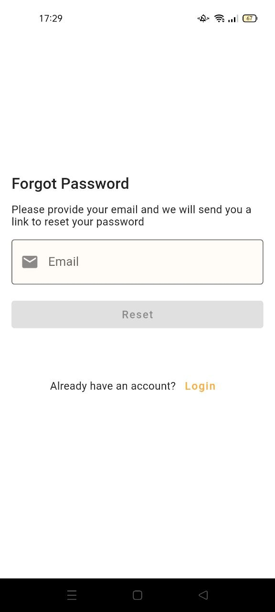
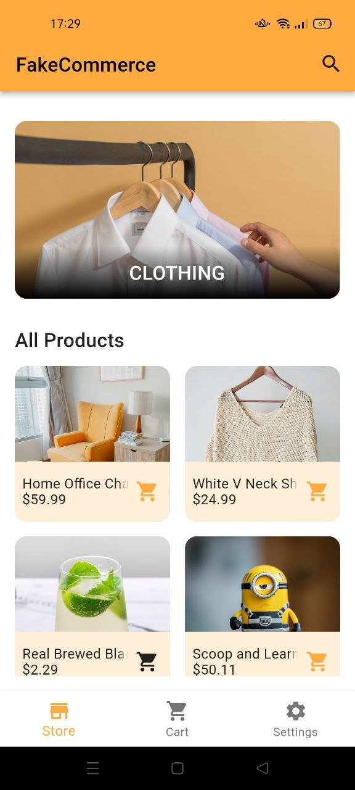
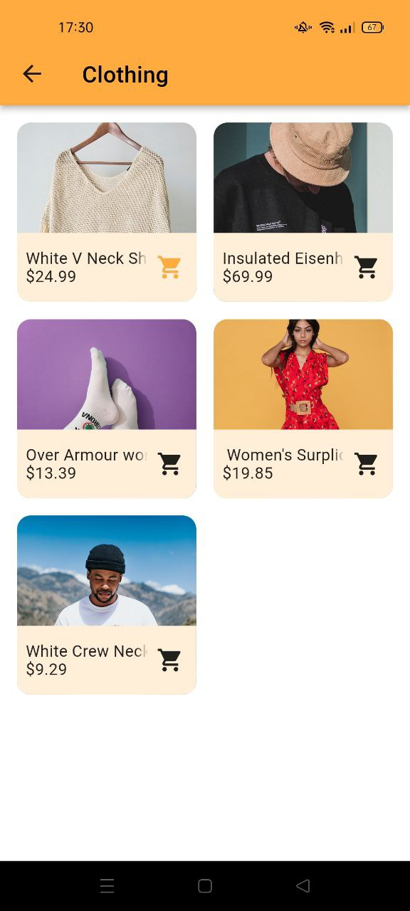
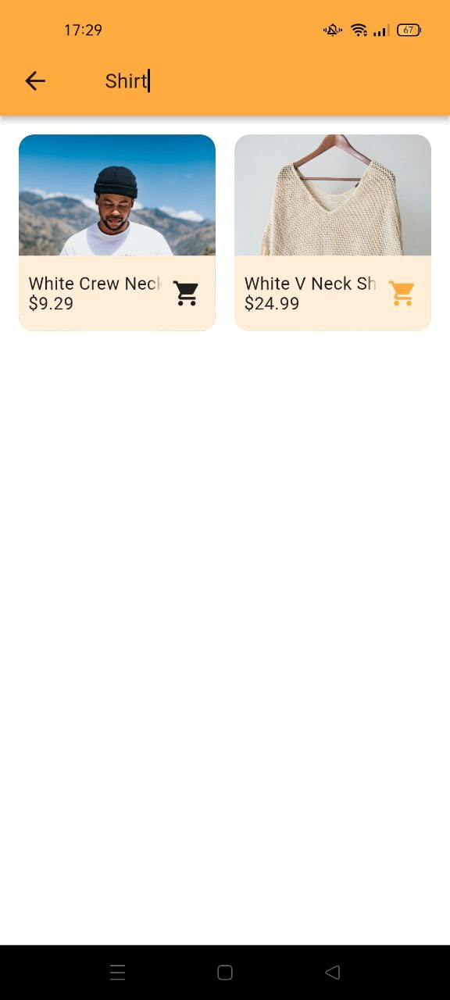
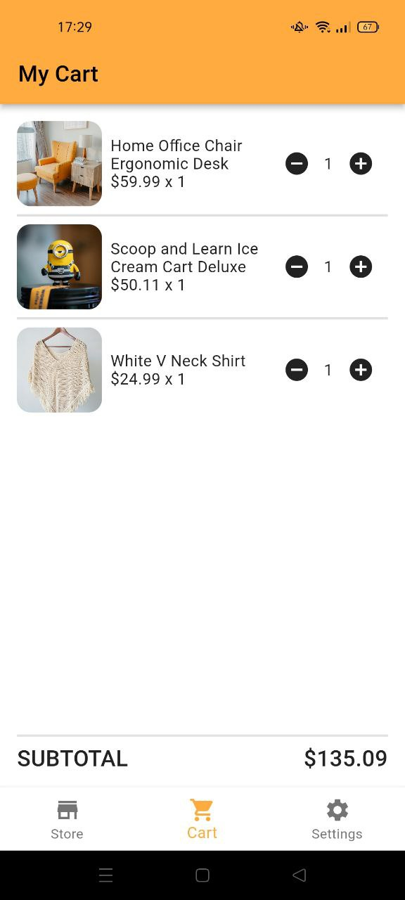
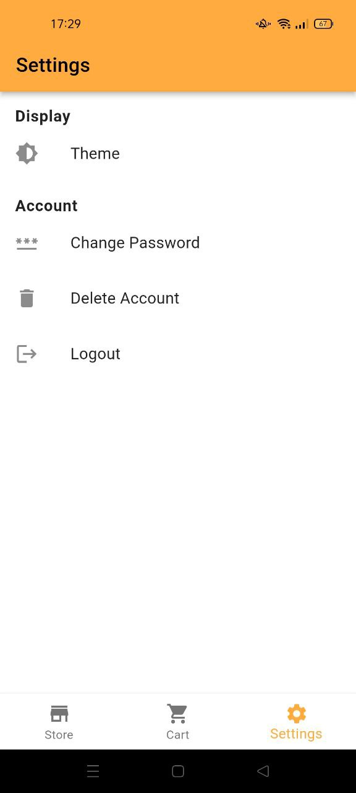

# FakeCommerce
Example Flutter e-commerce app.  

## Built With
- [Flutter](https://flutter.dev/) 
- [Dart](https://dart.dev/) 
- [Firebase](https://firebase.google.com/)
- [Algolia](https://www.algolia.com/)
- [Bloc](https://pub.dev/packages/flutter_bloc)   

## Features
- Login with Google
- Login with email and password 
- Register with email and password  
- Forgot/Reset password  
- Delete account
- Adaptive theme(light and dark)
- Search products and categories with [Algolia](https://www.algolia.com/)

## Preview

<table>
  <tr>
         <td>Login</td>
         <td>Register</td>
         <td>Forgot Password</td>
  </tr>
    <tr>
     <td></td>
     <td></td>
     <td></td>
  </tr>
  <tr>
         <td>Store</td>
         <td>Categories</td>
         <td>Search</td>
  <tr>
    <td></td>
    <td></td>
    <td></td>
  <tr>
  <tr>
         <td>Shopping Cart</td>
         <td>Settings</td>
  <tr>
    <td></td>
    <td></td>
  <tr>
 </table>
