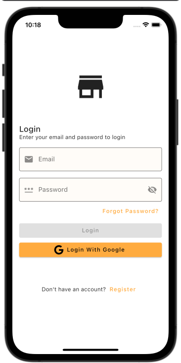
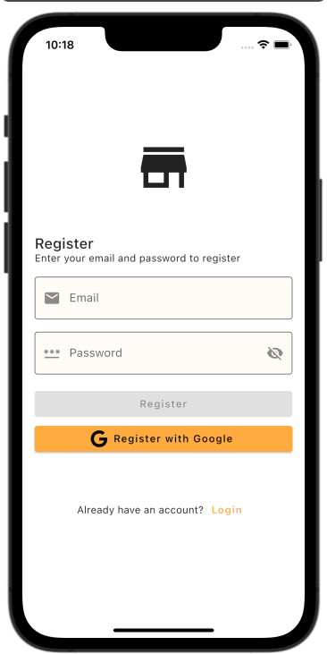
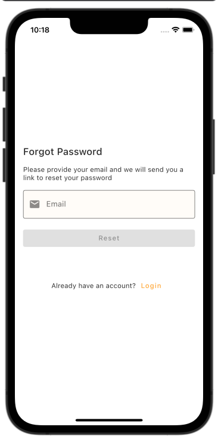
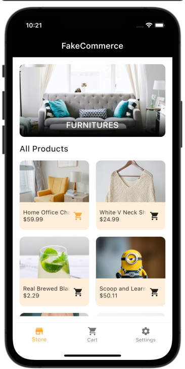
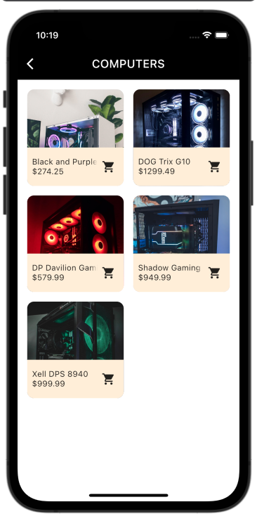
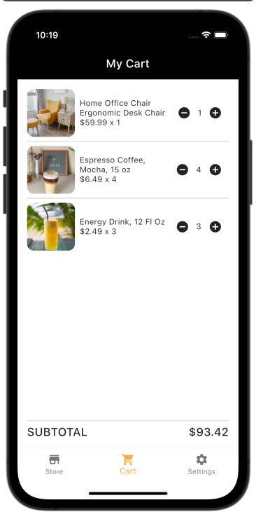
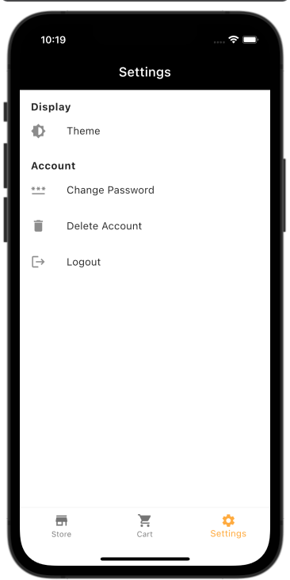

# FakeCommerce
Example Flutter e-commerce app.  


## Built With
- [Flutter](https://flutter.dev/) 
- [Dart](https://dart.dev/) 
- [Firebase](https://firebase.google.com/) 
- [Bloc](https://pub.dev/packages/flutter_bloc)   


## Features
- Login with Google 
- Login with email and password 
- Register with email and password  
- Forgot/Reset password  
- Delete account  
- Authentication error handling 
- Dark and light theme support  


## Getting Started

### Firebase  
1. Create your project 
2. Enable desired authentication methods from Firebase Console  

### iOS

1. Replace `./ios/Runner/GoogleService-Info.plist` with your own
2. Update `./ios/Runner/info.plist`
   - Paste the `REVERSED_CLIENT_ID` from `GoogleService-Info.plist` to key `CFBundleURLSchemes` in `info.plist`

### Android

1. Replace `./android/app/google-services.json` with your own
2. Update `./android/app/build.gradle`
   - Replace `"com.example.fake_commerce_firebase""` with the `package_name` from `google-services.json`

### Run build runner command
```sh
sh scripts/build_runner.sh
```

### Run the project

## Preview

<table>
  <tr>
         <td>Login</td>
         <td>Register</td>
         <td>Forgot Password</td>
  </tr>
    <tr>
     <td></td>
     <td></td>
     <td></td>
  </tr>
  <tr>
         <td>Store</td>
         <td>Categories</td>
         <td>Shopping Cart</td>
  <tr>
    <td></td>
    <td></td>
    <td></td>
  <tr>
  <tr>
         <td>Settings</td>
  <tr>
    <td></td>
  <tr>
 </table>
